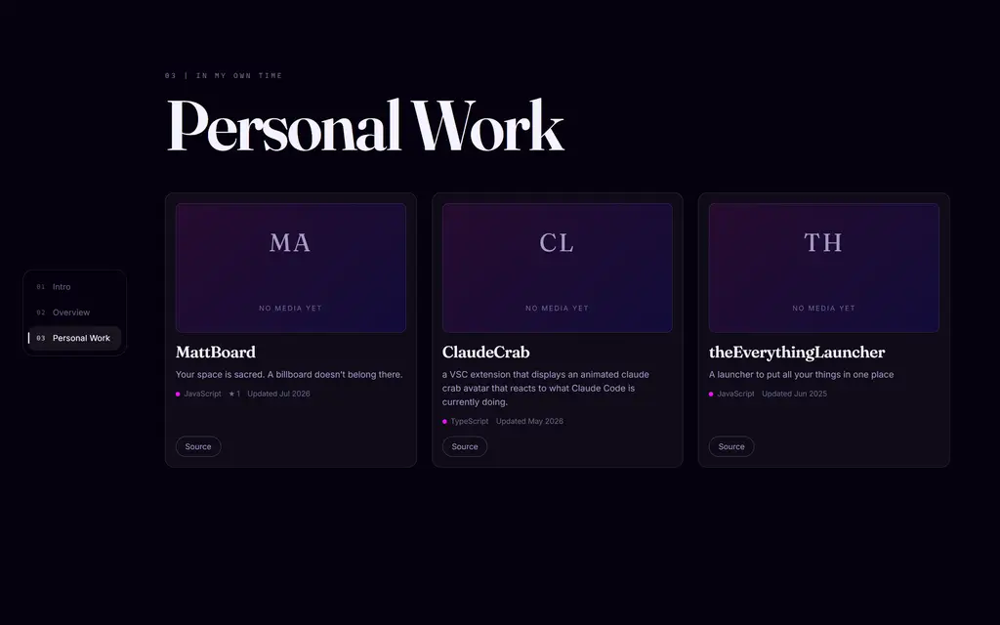

This is the site you are reading. It is a portfolio, which means it has one
job: make a handful of projects worth a stranger's attention, and get out of
the way while they read about them.

Everything below is either about how it presents that work, or about the small
number of things that were harder to build than they look.

## Three pages, and one that deals in sideways

The landing page is a stack of three full-screen pages. An intro with the
headline and a shader gradient behind it. An overview, which is the automatic
half of the site. And Personal Work, a grid of the projects I actually want to
talk about.

A project's own page is not a fourth page in that stack. It is a layer beside
it: opening one slides the whole stack left and deals the case study in from
the right, so the site reads as having been pushed aside rather than replaced.
The rail of page numbers goes with the stack, because while a project is open
those three pages are all off-screen and a rail pointing at them would be
lying.

It is still a real URL. Each project is `#project/<slug>`, pushed onto the
history stack, so Back closes it, the close button performs that same
navigation rather than a second parallel one, and a link to a project opens
directly on it with no intro animation in the way. Focus follows the layer in
and back out again, because a keyboard left on a control that just went inert
is a dead end.

## The hero ends on a torn edge



The chevron at the bottom of the intro is not an image, and it is not a second
gradient. The shader canvas is sized to one screen plus a band below it, so
there is real, still-animating gradient underneath the fold. An ink-coloured
rectangle covers that band, and the chevron is a hole punched in the cover. So
what shows through is the same canvas on the same frame, not a copy of it.

The outline of the hole is a full-width V with every point displaced along the
curve's normal by a smooth Gaussian process: 256 standard-normal samples on a
fixed lattice, interpolated across two octaves. Along the normal rather than
the tangent, because sliding a point sideways along a curve moves it to where
the curve already goes and changes nothing you can see.

Two details took the longest. The apex is softened, because a true `abs()` has
infinite curvature at its point and the normals either side of it disagree
hard enough to tear the edge across a single sample. And the noise tapers to
zero at both corners, where the hole meets the band's own edges: an excursion
there either pushes the boundary out through the top of the ink or leaves a
notch hanging off the side.

None of it animates. The path is computed once per resize and never touched on
a frame. The transition is the intro page sliding up and carrying it away,
which uncovers the band that was clipped.

## A page is not a scroll position

The document does not scroll. Each page is its own scroller, and moving
between them is a handover: one page slides off, then the next expands out
from under it. That is two animations in sequence, and a scroll offset can
only ever express one number, so scroll snapping could not have produced it.

What that buys is that a page's own overflow stays completely native. Reading
down this article is a plain scroll with plain momentum. The pager only takes
the gesture once the page has nothing left to give in that direction, and the
rule for when that counts is the same for the wheel, the arrow keys and a
swipe: the gesture must have *started* after the page ran out.

That last clause is the whole thing. Trackpad momentum after a flick arrives
as an unbroken stream of wheel events, so a flick that happens to coast into
the bottom of a page must not page: the stream has no gap in it. A held arrow
key is one press repeated. A swipe that began while the page could still
scroll is one swipe. Without that rule every long scroll ends one page further
down than you asked for. The threshold is 140 ms of quiet, and stopping and
pushing again is a second gesture, which does page.

The two durations live in one TypeScript constant and are published to CSS as
custom properties, because the animation and the input lock that spans it must
not be able to disagree: a lock outlasting its own animation is a page that
ignores you for no visible reason. Going back up, the second beat starts 160 ms
early. Downward the big movement comes first and reads as continuous; upward it
comes second, and the gap in front of it is dead air.

## The case study page

A project page leads with what it looks like, then what it is, then the facts
about it. The media comes first as a single frame with a thumbnail strip under
it, shown `contain` rather than `cover`, because a card crops its cover to line
up in a grid and this is the place the asset is actually looked at. The caption
row is reserved whether or not a slide has one, so stepping through does not
jog the article up and down.

Clips never autoplay. Someone opening a case study has come to read, and a
video that starts talking over that is an interruption.

The write-up runs down the middle at a 72-character measure, and the metadata
sits in a column beside it: status, year, language, last push, whether the repo
is public, the tag list and the links out. None of that is worth a screen of
its own, and a sidebar is where a reader already looks for it.

## The half I do not write

The overview page is everything GitHub already knows, read live rather than
copied: the profile, a language bar weighted by bytes across the repositories,
a year of contributions, and a belt of every public repo.

The belt drifts sideways at about 42 pixels a second by writing `scrollLeft`
rather than animating a transform, so the ambient motion and your own wheel or
swipe share one coordinate space. Taking hold of it is just scrolling it. It
pauses under the pointer, and on a timer after a wheel or a touch, since
neither of those has a hover to leave. One button swaps the whole thing for a
grid holding every repository at once, for anyone who would rather read than
chase.

## Where the write-ups come from

There is no CMS and no content folder here. Each project carries a `.portfolio`
directory in its own repository: a small JSON manifest, an `article.md`, and a
`media` folder. Publishing a project is a commit to that project. It is a
detail of execution rather than the point, but it is the reason the write-ups
stay accurate: they are edited in the same place as the code they describe.

Which projects appear is one environment variable, read at boot, where order is
display order and a bracketed group collapses several repos into one card.

Three of the projects here are private repositories, which is the one part of
that arrangement that needed real work. Their screenshots cannot be hotlinked,
and a credential must never reach the browser, so every asset is streamed back
through the API. The authorization check is a set-membership test and nothing
else: the server walks `.portfolio/media` itself, keeps only the paths whose
extension is on a fixed allowlist, and publishes those. A request for an asset
is answered not with "is this path safe?", which is how directory traversal
keeps happening, but with "is this one of the paths I published?" Nothing else
in the repository has a name that can be spelled.

The rest is caching. Unauthenticated GitHub allows 60 requests an hour, so
metadata is held for five minutes and content for fifteen, concurrent misses
on the same key share one upstream request, and failures are never cached.

## Two processes, one type

A Hono API on Node holds every credential and every cache. The browser gets a
Vite and React bundle that knows only its own origin, plus a typed RPC client
built from the server's route definitions. The client imports the server's
`AppType` as a type only, so no server code reaches the bundle, which means
renaming a route or changing a response shape breaks the front end at build
time rather than at runtime.

## One hostname, two origins

In development Vite proxies `/api` to the Hono process, which keeps the API
same-origin and means the browser never preflights anything. Production had to
preserve that or the two environments would disagree about a thing as basic as
whether CORS exists.

So there is one CloudFront distribution with two origins behind it. The
default behaviour serves the built client from an S3 bucket that has no public
path at all — block-public-access stays fully on, and CloudFront reaches it
with an origin access control, which is a signed request rather than a
permission. A second behaviour on `/api/*` points at the same Hono app running
as a Lambda. The browser sees one hostname, the RPC client keeps its relative
base URL, and `CORS_ORIGINS` is never consulted in production.

The Lambda sits behind a function URL in response-streaming mode rather than
the default buffered one. That is not a performance preference. The media
route pipes GitHub's response body straight through, and a buffered Lambda
response is capped at 6 MB after base64 inflation — about 4.4 MB of actual
bytes, which a single screen recording clears easily. Streaming raises the
ceiling to 200 MB and, more usefully, forwards the status and headers
untouched, so the `206` and `Content-Range` that a video player's seek depends
on survive the trip. API Gateway cannot stream at all, which is why the
distribution talks to a function URL directly.

Deep links needed one more piece. `/projects/<slug>` is a client route, so
asking S3 for it fetches an object that does not exist. The fix is a small
CloudFront function on viewer-request that rewrites any extension-less path to
`/index.html`. Deliberately a function attached to one behaviour, and not the
distribution's custom error responses, which are the obvious-looking answer:
those apply to every behaviour, so the API's genuine 404s — an unknown repo, a
slug that is not published — would come back as the HTML shell with status
200, and the client would report a parse failure instead of the server's own
message.

Caching splits on whether a filename is a promise. Vite content-hashes
everything under `assets/`, so those are immutable for a year and a new build
simply writes keys nobody has cached. Everything copied to the root keeps its
name across builds, so it is uploaded `no-cache` and invalidated by path.
Invalidating `/*` instead would be one line shorter and would evict the cached
project media along with it.

The one thing that genuinely changed shape is the cache inside the server. It
lives in a single execution environment, so every cold Lambda starts empty and
refetches. Unauthenticated GitHub allows 60 requests an hour *per IP*, on
addresses Lambda shares with other tenants, which makes the token mandatory in
production in a way it never was locally.

Each deploy is a tag. The commit is compiled into the bundle and written to
`/release.json`, so `GET /api/health` and a static file both name the same
release, and a deploy refuses to run at all against a dirty working tree —
otherwise "which commit is live" has no answer.

## Motion, and turning it off

With `prefers-reduced-motion` set, the shader stops animating, the intro's
band collapses to nothing so there is no chevron to uncover, and both halves of
every page handover collapse to zero, including the delay that sequences them.
That delay is the part a blanket duration override cannot reach, which is why
the timings are custom properties rather than a stylesheet of transitions.

## Running it

```bash
npm install
npm run dev
```

`npm run dev` is a small TUI rather than two panes of `concurrently`, for one
Windows-shaped reason: `tsx watch` and Vite both spawn children that survive a
plain Ctrl-C, so shutdown has to kill the process tree or the next run finds
both ports taken. It preflights the failures that otherwise surface as
confusing runtime errors instead of startup ones: no `GITHUB_USERNAME`,
workspaces not installed, a stale server already on 5173 or 3000.

A GitHub token is optional locally. Without one the site runs on the anonymous
rate limit and the contribution graph is missing, because GitHub only exposes
the calendar through GraphQL and GraphQL rejects anonymous requests outright.

Which token took a second pass. Everything the server reads is public except
the `.portfolio` directories of the three private projects, and the classic
scope that unlocks those is `repo` — read *and write* across every private
repository I can reach, sitting in a deployed environment variable so four
directories can be listed. A fine-grained token does the same job with
`Contents: Read-only` on exactly the repositories named in `PROJECT_REPOS`,
which is the difference between a leak costing me those four directories and
costing me everything.

## Still open

The loader waits for the shader to paint 20 stable frames before lifting,
which is honest but means a first visit is gated on WebGL compiling. The
gradient is also 1.1 MB of three.js — lazily imported, so it is off the
critical path, but it is still by far the largest thing the site ships for one
visual effect.

On the infrastructure side, project media is served straight from the Lambda
on every cache miss, and Lambda throttles a stream to 2 MB/s past the first
6 MB. A dedicated cache behaviour in front of `/api/github/projects/*` would
fix that, and has not been worth it while the largest asset is under a
megabyte. The certificate is also pinned to TLS 1.3 only, which is a stricter
choice than a portfolio warrants: it is the sort of setting that fails closed
on an old corporate laptop belonging to exactly the person the site is for.
