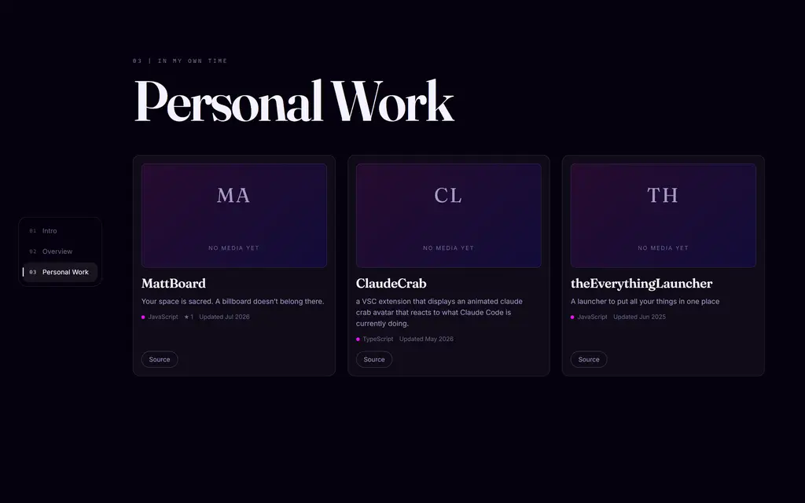
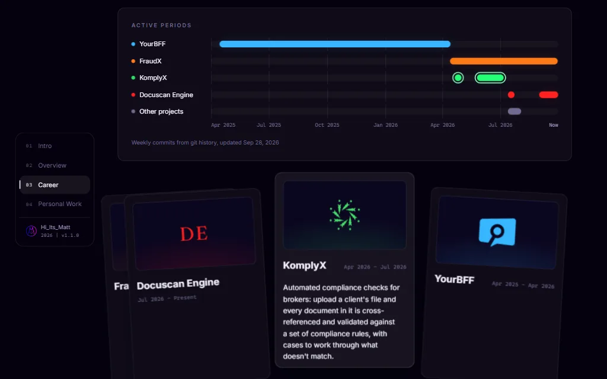

This is the site you are reading. It is a portfolio with one job: make a
handful of projects worth a stranger's attention, then get out of the way while
they read about them. What follows is how it presents that work, and the few
things that were harder to build than they look.

## Five pages, and one that deals in sideways

The landing page is a stack of five full-screen pages: an intro with the
headline over a shader gradient, an overview, my career, Personal Work (a grid
of the projects I actually want to talk about), and GitHub.

The stack reads front to back, but nobody has to. The overview is the
homepage: who I am and how to reach me, then a large card for each page behind
it, each showing a glimpse of what is there (my current role and its products'
logos, a fan of project covers, a year of commits). Clicking one jumps straight
there with the same handover as the side nav, so a visitor who reads only one
page still sees everything else on offer.

Every page is a real path (`/career`, `/projects`), so a reload or a shared link
comes back to the same page. Changing page replaces the history entry rather than
pushing one, so Back leaves the site instead of rewinding through every page on
the way. Links shared from when pages were `#` fragments still land where they
pointed, and the address is rewritten to the path on arrival.

A project's own page is not a sixth page in the stack. It is a layer beside it:
opening one slides the whole stack left and deals the case study in from the
right, so the site reads as pushed aside rather than replaced. Each project is
its own URL (`/projects/<slug>`) pushed onto history, so Back closes it, a direct
link opens straight on it, and focus follows the layer in and back out.

## The hero ends on a torn edge



The chevron at the bottom of the intro is a hole, not an image. The shader
canvas is sized to one screen plus a band below the fold; an ink-coloured
rectangle covers that band, and the chevron is punched out of the cover, so what
shows through is the same canvas on the same frame.

The hole's outline is a full-width V displaced along the curve's normal by a
smooth Gaussian process. Two details took the longest: the apex is softened,
because a true `abs()` has infinite curvature and tears the edge; and the noise
tapers to zero at both corners, so an excursion cannot push the boundary out
through the ink or leave a notch hanging off the side. None of it animates. The
path is computed once per resize; the intro sliding up is what uncovers it.

## A page is not a scroll position

The document does not scroll. Each page is its own scroller, and moving between
them is a handover: one page slides off, then the next expands out from under
it. That is two animations in sequence, which a single scroll offset could never
express, so scroll snapping was never an option. The payoff is that a page's own
overflow stays completely native, like this article. Neither page scrolls while
a handover is running, so the tail of the gesture that turned the page cannot
start reading down the next one before it has settled; the scrollbar's gutter is
reserved throughout, so hiding it for that moment never reflows the content.

The pager only takes the gesture once the page has nothing left to give, and the
rule is the same for wheel, arrow keys and swipe: the gesture must have *started*
after the page ran out. That last clause is the whole thing. Trackpad momentum
arrives as an unbroken stream of wheel events, so a flick that coasts into the
bottom must not page. The threshold is 140 ms of quiet. The two durations live
in one TypeScript constant published to CSS as custom properties, so the
animation and the input lock that spans it cannot disagree.

## The case study page

A project page leads with what it looks like, then what it is, then the facts.
The media comes first as a single frame with a thumbnail strip, shown `contain`
rather than `cover`, because this is where the asset is actually looked at.
Clips never autoplay: someone opening a case study has come to read. The write-up
runs down the middle at a 72-character measure, with metadata (status, year,
language, last push, tags, links) in a column beside it.

## Work I cannot link to



Most of what I have built was built at work, in repositories nobody outside can
open. The career page shows it anyway, without showing any of the code. Each
employer gets a timeline of the products I worked on, drawn from weekly commit
counts: four quiet weeks end a period, and heavier stretches land harder when
the bars launch in.

Those counts come from a small CLI run on my own machine against local clones.
The work repositories belong to another account, and the only token that could
read their history from GitHub would also read every line of their source, so
the history is read locally and only dates and counts leave the machine: no
code, messages, hashes, file names or repository names. The CLI publishes that,
plus the hand-written employers, products and logos, as documents in a private
data bucket the API reads. Adding an employer is a publish, not a deploy.

Under each timeline the products are a hand of cards, fanned on an arc. Pointing
at a card, or at its row on the graph, lifts it and parts the others around it.
Clicking plays it: the page scrolls so the graph sits just above the hand, and
the card grows to whatever fits beneath it (up to one and a half times) and turns
over to show what I built on it, while the rest of the hand steps aside into a
stack on either side, each still a strip you can point at and play. The graph
and the hand only play in once they scroll into view, and once per visit: an
employer further down is not animated where nobody can see it, and scrolling
back up to one does not replay it.

## The half I do not write

The last page is everything GitHub already knows, read live: the profile, a
language bar weighted by bytes, a year of contributions, and a belt of every
public repo. The belt drifts sideways by writing `scrollLeft` rather than
animating a transform, so the ambient motion and your own wheel share one
coordinate space. It pauses under the pointer, and one button swaps it for a
grid of every repository at once.

## Where the write-ups come from

There is no CMS. Each project carries a `.portfolio` directory in its own repo:
a JSON manifest, an `article.md`, and a `media` folder. Publishing a project is
a commit to that project, which is why the write-ups stay accurate: they are
edited beside the code they describe. Which projects appear is one environment
variable, read at boot.

Three of the projects are private repositories, the one part that needed real
work. Their assets cannot be hotlinked and a credential must never reach the
browser, so every asset is streamed back through the API. The authorization
check is a set-membership test: the server walks `.portfolio/media`, keeps only
allowlisted extensions, and answers a request not with "is this path safe?" but
"is this one of the paths I published?" The rest is caching. Unauthenticated
GitHub allows 60 requests an hour, so metadata is held five minutes and content
fifteen, concurrent misses share one upstream request, and failures are never
cached.

## Two processes, one type

A Hono API on Node holds every credential and cache. The browser gets a Vite and
React bundle that imports the server's `AppType` as a type only, so no server
code ships, and renaming a route or changing a response shape breaks the front
end at build time rather than runtime.

## One hostname, two origins

In development Vite proxies `/api` to Hono, keeping the API same-origin so the
browser never preflights. Production preserves that with one CloudFront
distribution over two origins: the default behaviour serves the built client
from a private S3 bucket (block-public-access fully on, reached by origin access
control), and `/api/*` points at the same Hono app running as a Lambda. The
browser sees one hostname and `CORS_ORIGINS` is never consulted in production.

The Lambda uses a function URL in response-streaming mode. That is not a
performance preference: the media route pipes GitHub's body straight through,
and a buffered Lambda response caps at ~4.4 MB of actual bytes, which one screen
recording clears easily. Streaming raises the ceiling and forwards status and
headers untouched, so the `206` and `Content-Range` a video seek depends on
survive. API Gateway cannot stream, which is why the distribution talks to the
function URL directly.

Deep links needed one more piece. Every page is a client route, so a small
CloudFront function on viewer-request rewrites any extension-less path to
`/index.html`. It is attached to one behaviour rather than the distribution's
error responses, so the API's genuine 404s still come back as real 404s instead
of the HTML shell with status 200. Caching splits on whether a filename is a
promise: Vite content-hashes everything under `assets/`, immutable for a year;
root files keep their name and are uploaded `no-cache` and invalidated by path.

The API keeps its own documents, the career data and last-known-good snapshots
of what it reads from GitHub, in a second private bucket that only the
function's role can read and write.

## Motion, and turning it off

With `prefers-reduced-motion` set, the shader stops animating, the intro's band
collapses so there is no chevron to uncover, and both halves of every page
handover collapse to zero, including the delay that sequences them. That delay
is the part a blanket duration override cannot reach, which is why the timings
are custom properties.

## Running it

```bash
npm install
npm run dev
```

`npm run dev` is a small TUI rather than two panes of `concurrently`, for one
Windows reason: `tsx watch` and Vite spawn children that survive a plain
Ctrl-C, so shutdown has to kill the process tree. It also preflights the
failures that otherwise surface as confusing runtime errors: no
`GITHUB_USERNAME`, workspaces not installed, a stale server on 5173 or 3000.

A GitHub token is optional locally, but in production it is mandatory: a
fine-grained token with `Contents: Read-only` on exactly the repositories in
`PROJECT_REPOS` does the job that the classic `repo` scope would only do with
read and write across every private repo I can reach.

## Still open

The loader waits for the shader to paint 20 stable frames before lifting, so a
first visit is gated on WebGL compiling, and the gradient is 1.1 MB of three.js
(lazily imported, but still the largest thing the site ships for one effect). On
the infrastructure side, project media is served straight from the Lambda on
every cache miss; a dedicated cache behaviour in front of the media route would
fix that, and has not been worth it while the largest asset is under a megabyte.
